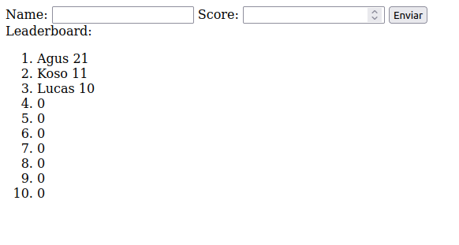

# Leaderboard web page

## How to use
You can deploy the web page locally doing:
`docker compose up --build`  
When being in the same path as the docker-compose.yml. Now you can see the webpage at localhost:80

Or you can deploy it to a kubernetes cluster doing `kubectl apply -f [file_name].yaml` of all the yamls in the /kubernetes_yaml directory

Some applies must be done in order, I recommend this order:
```
kubectl apply -f metallb_config.yaml

kubectl apply -f nginx_configmap.yaml
kubectl apply -f client_deployment.yaml
kubectl apply -f client_service.yaml

kubectl apply -f server_deployment.yaml
kubectl apply -f server_service.yaml

kubectl apply -f redis_deployment.yaml
kubectl apply -f redis_service.yaml

```
You might not need metallb_config depending on your cluster configs.

